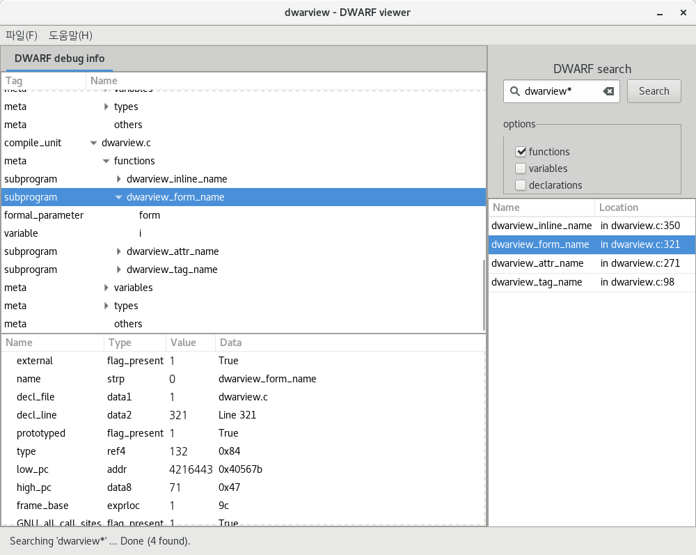

DWARVIEW
========
The dwarview is a GUI program that displays DWARF debug info in a file.
It also supports search functions and variables by name (with glob pattern).
It's written in C using GTK+3 and libdw library from elfutils.

 * Homepage: https://github.com/namhyung/dwarview

Screenshot
==========

